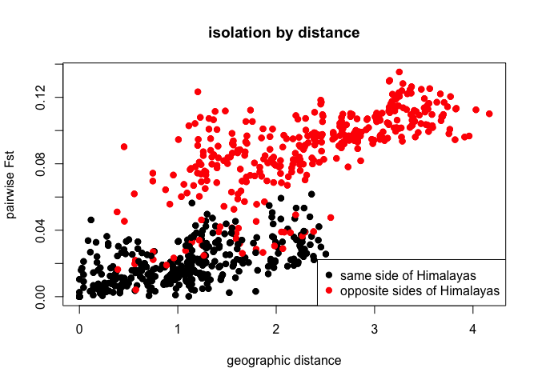

F-statistics from genotypic data:
---------------------------------

In this exercise we will estimate the **Fst**, which is the expected
level of heterozygosity in a population. The expected heterozygosity
frequencies are drawn under the conditions of **Hardy-Weiberg Theorem**.
It can be used to measure also the genetic variation across populations,
by looking at the deviations of genetic diversity withing subpopulations
(*H**S*) to the genetic diversity of the total population
(*H**T*):

$F\_{ST} = \\frac{H\_T - H\_S}{H\_T}$

9 equations will be used in this exercise:

1 Calculation of allele frequencies:

$p = \\frac{(2AA + Aa)}{2N}$

2 Calculation of the expected genotypic counts under HWE:

-   Expected AA = *p*2 \* *N*
-   Expected Aa = 2*p* \* *q* \* *N*
-   Expected aa = *q*2 \* *N*

3 Calculate the local observed heterozygosity

$H\_{obs} = \\frac{Aa}{N}$

4 Calculate the local expected heterozygosity

*H**e**x**p* = 2*p**q*

1.  Calculate the local inbreeding coefficient of each subpopulation

$F\_S = \\frac{H\_{exp} -H\_{obs}}{H\_{exp}}$

1.  Calculate $\\bar{p}$ (the frequency pf allele **A** over the
    total population)

$\\bar{p} = \\frac{2\*AA\_{pop1} + Aa\_{pop1} + 2\*AA\_{pop2} + Aa\_{pop2} + 2\*AA\_{pop3} + Aa\_{pop3}}{2\*N\_{pop1} 2\*N\_{pop2} + 2\*N\_{pop3}}$

1.  Calculate $\\bar{q}$ (the frequency pf allele **a** over the
    total population)

$\\bar{q} = \\frac{2\*aa\_{pop1} + Aa\_{pop1} + 2\*aa\_{pop2} + Aa\_{pop2} + 2\*aa\_{pop3} + Aa\_{pop3}}{2\*N\_{pop1} 2\*N\_{pop2} + 2\*N\_{pop3}}$

1.  Calculate the global heterozygosity indices ( over **I**ndividuals,
    **S**ubpopulations and **T**otal population)

2.  *H**I* based on observed heterozygosties in individuals
    in subpopulations:

$H\_I =\\frac{H\_{obs1}\*N\_1 + H\_{obs2}\*N\_2 + H\_{obs3}\*N\_{3}}{N{total}}$

1.  *H**S* based on **expected** heterozygosities in
    **subpopulations**:

$H\_S =\\frac{H\_{exp1}\*N\_1 + H\_{exp2}\*N\_2 + H\_{exp3}\*N\_3}{N\_{total}}$

1.  *H**T* based o expected heterozygosities for overall
    total population: $H\_T = 2\\bar{p}\\bar{q}$

2.  Calculate the Fst:

$F\_{ST} = \\frac{H\_T - H\_S}{H\_T}$

    ## Let's imagine that we have the following genotypes and genotype frequencies in each population:
    M <- as.matrix(rbind(c(125, 250, 125), c(50, 30, 20), c(100, 500, 400)))
    dimnames(M) <- list(c("Pop1", "Pop2", "Pop3"), c("AA","Aa", "aa"))

    print(M)

    ##       AA  Aa  aa
    ## Pop1 125 250 125
    ## Pop2  50  30  20
    ## Pop3 100 500 400

    # What is the number of individuals genotyped in each population?
    N = rowSums(M)

    # Now let's calculate the allele frequencies in each population. Remember that the number of alleles is twice the number of genotypes.

    # Allele A: 
    pop1_p = (2*M[1,1] + M[1,2])/(2*N[[1]])

    # Allele a:
    pop1_q = (2*M[1,3] + M[1,2])/(2*N[[1]])

    # Calculate the observed frequency of allele A for the other 2 populations

    # Now calculate the local observed heterozygosity:

    H_obs_pop1 = 250/500
    H_obs_pop2 = 30/100
    H_obs_pop3 = 500/1000

    # What would be the expected heterozygosity? Remember about the concepts of Hardy Weinberg equilibrium:
    H_exp_pop1 = 2*pop1_p*pop1_q

    # What is the local inbreeding coefficient of each population?
    #F_s = (H_exp - H_obs )/ (H_exp)

    F_s_pop1 = (H_exp_pop1 - H_obs_pop1) / H_exp_pop1

    # Now calculate the frequency of allele A over the total population (remember to mutiple the N frequencies):
    A_s = (2*colSums(M)[[1]] + colSums(M)[[2]])/(2*sum(rowSums(M)))
    a_s = (2*colSums(M)[[3]] + colSums(M)[[2]])/(2*sum(rowSums(M)))

    # Check if the calculations make sense. p + q must be equal to 1
    A_s + a_s

    ## [1] 1

    # Now calculate the expected heterozygosity in subpopulations: 

Applying Fst in a real dataset:
===============================

HGDP-CEPH Human Genome Diversity Cell Line Panel
------------------------------------------------

In the next exercise we will be using the data from HGDP Panel, a
consortium created to allow further research in human population
genetics.  
A resource of 1063 lymphoblastoid cell lines (LCLs) from 1050
individuals in 52 world populations and corresponding milligram
quantities of DNA is banked at the Foundation Jean Dausset-CEPH in
Paris. These LCLs were collected from various laboratories by the Human
Genome Diversity Project (HGDP) and CEPH in order to provide unlimited
supplies of DNA and RNA for studies of sequence diversity and history of
modern human populations. Information for each LCL is limited to sex of
the individual, population and geographic origin.

    #With the HGDP dataset

    #install.packages('BEDASSLE')
    library(BEDASSLE)

    data(HGDP.bedassle.data)

    # Have a loog at what variables the data contain:
    ?HGDP.bedassle.data()

    # How many populations does the data include?
    HGDP.bedassle.data$hgdp.metadata$Population

    ##  [1] "Adygei"      "Basque"      "Italian"     "French"      "Orcadian"   
    ##  [6] "Russian"     "Sardinian"   "Tuscan"      "Bedouin"     "Druze"      
    ## [11] "Mozabite"    "Palestinian" "Balochi"     "Brahui"      "Burusho"    
    ## [16] "Hazara"      "Kalash"      "Makrani"     "Pathan"      "Sindhi"     
    ## [21] "Cambodian"   "Dai"         "Daur"        "Han"         "Hezhen"     
    ## [26] "Japanese"    "Lahu"        "Miao"        "Mongola"     "Naxi"       
    ## [31] "Oroqen"      "She"         "Tu"          "Tujia"       "Uygur"      
    ## [36] "Xibo"        "Yakut"       "Yi"

    #Draw 2 populations at random from the Eurasian HGDP dataset
        pop1 <- sample(nrow(HGDP.bedassle.data$allele.counts),1)
        pop2 <- sample(nrow(HGDP.bedassle.data$allele.counts),1)

    #Calculate unbiased Fst between them
        pairwise.Fst <- calculate.pairwise.Fst(
            HGDP.bedassle.data$allele.counts[c(pop1,pop2),],
            HGDP.bedassle.data$sample.sizes[c(pop1,pop2),]  
        )

    #Print that Fst to the console
        print(sprintf("Fst between the %s population and the %s population is %s",
            HGDP.bedassle.data$hgdp.metadata[pop1,1],
            HGDP.bedassle.data$hgdp.metadata[pop2,1],
            round(pairwise.Fst,3))
         )

    ## [1] "Fst between the She population and the Uygur population is 0.038"

    # Now Calculate the Fst between populations from "French" and "Hezhen"
        (pairwise.Fst <- calculate.pairwise.Fst(
            HGDP.bedassle.data$allele.counts[c("French","Hezhen"),],
            HGDP.bedassle.data$sample.sizes[c("French","Hezhen"),]  
        ))

    ## [1] 0.09608346

    #Calculate pairwise Fst between all population pairs
        hgdp.pairwise.Fst <- calculate.all.pairwise.Fst(
            HGDP.bedassle.data$allele.counts,
            HGDP.bedassle.data$sample.sizes
        )   

    colnames(hgdp.pairwise.Fst) = HGDP.bedassle.data$hgdp.metadata$Population
    rownames(hgdp.pairwise.Fst) = HGDP.bedassle.data$hgdp.metadata$Population
    heatmap(hgdp.pairwise.Fst, names = HGDP.bedassle.data$hgdp.metadata$Population)

    ## Warning in plot.window(...): "names" is not a graphical parameter

    ## Warning in plot.xy(xy, type, ...): "names" is not a graphical parameter

    ## Warning in title(...): "names" is not a graphical parameter

        #Plot pairwise Fst against geographic distance
        plot(HGDP.bedassle.data$GeoDistance,
            hgdp.pairwise.Fst,
            pch=19,
            col=HGDP.bedassle.data$EcoDistance+1,
            ylab="pairwise Fst",
            xlab="geographic distance",
            main="isolation by distance")
                legend(x="bottomright",pch=19,col=c(1,2),
                    legend=c("same side of Himalayas",
                            "opposite sides of Himalayas"))

