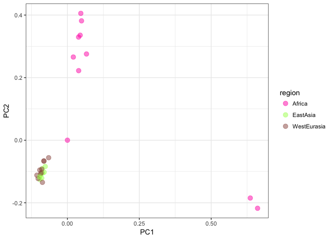
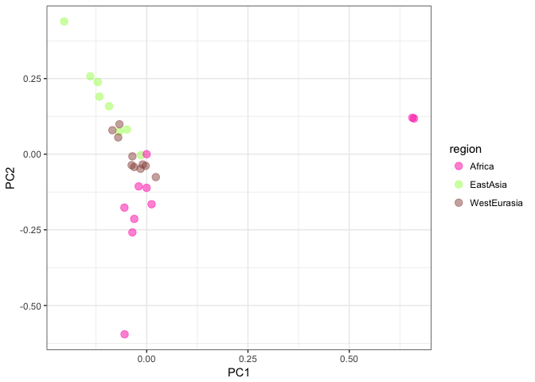

Population Structure analysis
-----------------------------

With the advent of SNP chip data it is possible to precisely infer the genetic distance across individuals or populations. As written in the book, one way of doing it is by comparing each SNP from each individual against every other individual. This comparison produces the so called: covariance matrix, which in genetic terms means the number of shared polymorphisms across individuals. There are many ways to visualize this data, in this tutorial you will be exposed to `Principal Component Analysis` and `Admixture`.

``` r
# Dependencies
#install.packages('SNPRelate')
library(SNPRelate)
```

    ## Loading required package: gdsfmt

    ## SNPRelate -- supported by Streaming SIMD Extensions 2 (SSE2)

``` r
library(ggplot2)

# Reading the vcf file and doing the eigendecomposition
info = read.csv("/Users/PM/Downloads/sample_infos_accessionnb.csv", header = T, sep = ';')

vcf.fn <- "/Users/PM/Downloads/Allvariants_135_145_chr2.vcf"
snpgdsVCF2GDS(vcf.fn, "/Users/PM/Downloads/first.gds",  method="biallelic.only")
```

    ## VCF Format ==> SNP GDS Format
    ## Method: exacting biallelic SNPs
    ## Number of samples: 28
    ## Parsing "/Users/PM/Downloads/Allvariants_135_145_chr2.vcf" ...
    ##  import 49868 variants.
    ## + genotype   { Bit2 28x49868, 340.9K } *
    ## Optimize the access efficiency ...
    ## Clean up the fragments of GDS file:
    ##     open the file '/Users/PM/Downloads/first.gds' (639.0K)
    ##     # of fragments: 48
    ##     save to '/Users/PM/Downloads/first.gds.tmp'
    ##     rename '/Users/PM/Downloads/first.gds.tmp' (638.7K, reduced: 336B)
    ##     # of fragments: 20

``` r
genofile <- openfn.gds("/Users/PM/Downloads/first.gds")
pca <- snpgdsPCA(genofile)
```

    ## Hint: it is suggested to call `snpgdsOpen' to open a SNP GDS file instead of `openfn.gds'.

    ## Principal Component Analysis (PCA) on genotypes:
    ## Excluding 0 SNP on non-autosomes
    ## Excluding 397 SNPs (monomorphic: TRUE, < MAF: NaN, or > missing rate: NaN)
    ## Working space: 28 samples, 49,471 SNPs
    ##     using 1 (CPU) core
    ## PCA: the sum of all selected genotypes (0, 1 and 2) = 2250084
    ## Mon Feb 19 14:58:59 2018    (internal increment: 26768)
    ## 
    [..................................................]  0%, ETC: ---    
    [==================================================] 100%, completed      
    ## Mon Feb 19 14:58:59 2018    Begin (eigenvalues and eigenvectors)
    ## Mon Feb 19 14:58:59 2018    Done.

``` r
summary(pca)
```

    ##           Length Class  Mode     
    ## sample.id    28  -none- character
    ## snp.id    49471  -none- numeric  
    ## eigenval     28  -none- numeric  
    ## eigenvect   784  -none- numeric  
    ## varprop      28  -none- numeric  
    ## TraceXTX      1  -none- numeric  
    ## Bayesian      1  -none- logical  
    ## genmat        0  -none- NULL

``` r
attach(pca)

eigenvectors = as.data.frame(pca$eigenvect)
colnames(eigenvectors) = as.vector(sprintf("PC%s", seq(1:nrow(pca$eigenvect))))
pca$sample.id = sub("_chr2_piece_dedup", "", pca$sample.id)

# Matching the sample names with their origin and population
eigenvectors$region = info[match(pca$sample.id, info$ENA.RUN),]$region 
eigenvectors$population = info[match(pca$sample.id, info$ENA.RUN),]$population
```

Let's first produce look at how much of the variance of the data is explained by each eigenvalue (or PC):

``` r
#p <- qqplot(aes(y = as.numeric(pca$eigenval), x=seq(1, length(pca$eigenval))))

#+ 
#        geom_point(size=3,alpha=0.5) +
#        scale_color_manual(values = c("#FF1BB3","#A7FF5B","#99554D")) +
#        theme_bw()
```

Now, let's plot the two first PC's and color the datapoints by the origin of each individual sample.

``` r
ggplot(data = eigenvectors, aes(x = PC1, y = PC2, col = region)) + 
        geom_point(size=3,alpha=0.5) +
        scale_color_manual(values = c("#FF1BB3","#A7FF5B","#99554D")) +
        theme_bw()
```



Try to plot PC2 and PC3. Do you see the same patterns? Now we will implement LD prunning

``` r
set.seed(1000)

# Try different LD thresholds for sensitivity analysis
snpset <- snpgdsLDpruning(genofile, ld.threshold=0.2)
```

    ## Hint: it is suggested to call `snpgdsOpen' to open a SNP GDS file instead of `openfn.gds'.

    ## SNP pruning based on LD:
    ## Excluding 0 SNP on non-autosomes
    ## Excluding 397 SNPs (monomorphic: TRUE, < MAF: NaN, or > missing rate: NaN)
    ## Working space: 28 samples, 49,471 SNPs
    ##     using 1 (CPU) core
    ##  Sliding window: 500000 basepairs, Inf SNPs
    ##  |LD| threshold: 0.2
    ## Chromosome 2: 0.96%, 478/49868
    ## 478 SNPs are selected in total.

``` r
# Get all selected snp id
snpset.id <- unlist(snpset)

pca_pruned <- snpgdsPCA(genofile, snp.id=snpset.id, num.thread=2)
```

    ## Hint: it is suggested to call `snpgdsOpen' to open a SNP GDS file instead of `openfn.gds'.

    ## Principal Component Analysis (PCA) on genotypes:
    ## Excluding 49,390 SNPs (non-autosomes or non-selection)
    ## Excluding 0 SNP (monomorphic: TRUE, < MAF: NaN, or > missing rate: NaN)
    ## Working space: 28 samples, 478 SNPs
    ##     using 2 (CPU) cores
    ## PCA: the sum of all selected genotypes (0, 1 and 2) = 24955
    ## Mon Feb 19 14:59:00 2018    (internal increment: 26768)
    ## 
    [..................................................]  0%, ETC: ---    
    [==================================================] 100%, completed      
    ## Mon Feb 19 14:59:00 2018    Begin (eigenvalues and eigenvectors)
    ## Mon Feb 19 14:59:00 2018    Done.

``` r
eigenvectors = as.data.frame(pca_pruned$eigenvect)
colnames(eigenvectors) = as.vector(sprintf("PC%s", seq(1:nrow(pca$eigenvect))))
pca_pruned$sample.id = sub("_chr2_piece_dedup", "", pca$sample.id)

# Matching the sample names with their origin and population
eigenvectors$region = info[match(pca_pruned$sample.id, info$ENA.RUN),]$region 
eigenvectors$population = info[match(pca_pruned$sample.id, info$ENA.RUN),]$population

ggplot(data = eigenvectors, aes(x = PC1, y = PC2, col = region)) + 
        geom_point(size=3,alpha=0.5) +
        scale_color_manual(values = c("#FF1BB3","#A7FF5B","#99554D")) +
        theme_bw()
```


